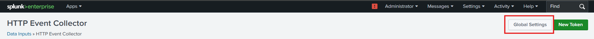

# Splunk integration in Spring 

## **1. Configure Splunk to Receive Logs**

Since your Splunk is running in a Docker container, you need to ensure it is configured to receive logs over HTTP.

### **Enable HTTP Event Collector (HEC) in Splunk**

1. **Access Splunk UI:** Open `http://localhost:8000` and log in with the username `admin` and the password you set.

2. **Enable HEC:** 

   - Go to **Settings → Under Data (Data Inputs)**  
   - Click **HTTP Event Collector**  

   

   - Click **Global Settings** 

   

   - Select **All tokens →** **Enabled**
   - Select **Default Source Type → _json** 
   - Ensure HTTP port Number is set **8088**
   - Click **Save**

   

3. **Create a New Token:**  

   - Click **New Token**

   

   - Give it a name (e.g., `todoapp-logs`)  
   - Provide source name as `http-event-logs`

   

   - Select source type a `log4j`
   - Select an index or create a new one (e.g., `todoapp_index`)  

      

   - Click **Review → Submit**

   

4. **Copy the Token Value**

   - Save this token as you'll need it in your Spring Boot application.

   

## **2. Add Splunk Logging Dependency in Spring Boot**

Add the following dependency to your `pom.xml`:

```xml
<repositories> 
 <repository> 
        <id>splunk-artifactory</id> 
        <name>Splunk Releases</name> 
        <url>https://splunk.jfrog.io/splunk/ext-releases-local</url> 
    </repository> 
</repositories> 

<dependency>
    <groupId>org.springframework.boot</groupId>
    <artifactId>spring-boot-starter</artifactId>
    <exclusions>
        <exclusion>
            <groupId>org.springframework.boot</groupId>
            <artifactId>spring-boot-starter-logging</artifactId>
        </exclusion>
    </exclusions>
</dependency>
<dependency>
	<groupId>org.springframework.boot</groupId>
	<artifactId>spring-boot-starter-log4j2</artifactId>
</dependency>
<dependency>
	<groupId>com.splunk.logging</groupId>
	<artifactId>splunk-library-javalogging</artifactId>
	<version>1.8.0</version>
</dependency>
```

After adding dependencies to `pom.xml` update the project

## **3. Configure `log4j2.xml` for Splunk Logging**

Create or update `src/main/resources/log4j2.xml`:

```xml
<?xml version="1.0" encoding="UTF-8"?>
<Configuration>
    <Appenders>
        <Console name="console" target="SYSTEM_OUT">
            <PatternLayout
                    pattern="%style{%d{ISO8601}} %highlight{%-5level }[%style{%t}{bright,blue}] %style{%C{10}}{bright,yellow} %style{%logger{36}}{cyan}: %msg%n%throwable" />
        </Console>
        
        <SplunkHttp
                name="splunkhttp"
                url="${env:SPLUNK_URL}"
    			    token="${env:SPLUNK_TOKEN}"
                host="localhost"
                index="todoapp_index"
                type="raw"
                source="http-event-logs"
                sourcetype="log4j"
                messageFormat="text"
                disableCertificateValidation="true">
            <PatternLayout pattern="%m" />
        </SplunkHttp>
    </Appenders>

    <Loggers>
        <Logger name="com.company.todoapp" level="trace" additivity="false">
            <AppenderRef ref="console"/>
            <AppenderRef ref="splunkhttp"/>
        </Logger>
        <Root level="trace">
		    <AppenderRef ref="console" />
		    <AppenderRef ref="splunkhttp" />
		</Root>

    </Loggers>
</Configuration>
```

## **4. Dockerize the Spring Boot Application**

Create a `Dockerfile` in your Spring Boot project root:

```dockerfile
FROM openjdk:11.0.15-jre
ADD target/*.jar app.jar
ENTRYPOINT ["java","-jar","app.jar"]
```

## **5. Build and Run the Application in Docker**

### **Build the JAR file**

```sh
mvn clean package
```

### **Build the Docker Image**

```sh
docker build -t todoappsplunk .
```

### **Run the Container**

Ensure your Splunk container is running, then start your Spring Boot app and run in the same network:

```sh
docker run -p 8081:8081 -e SPLUNK_URL="http://host.docker.internal:8088" -e SPLUNK_TOKEN="your-splunk-token" --name todoapp vijaynvb/todoappsplunk:latest
```

## **Check Logs in Splunk**

- Go to **http://localhost:8000** → **Search & Reporting**.

- Run the search query:

  ```splunk
  index=todoapp_index
  ```


## **Setting Alerts in Splunk for `TodoWarn` and `TodoError` Logs**

### **Define Log Messages for Alerts**

In your **`TodoDBService`**, you already have:

- **WARN Logs** (`TodoWarn`): When a todo is not found.
- **ERROR Logs** (`TodoError`): When an exception occurs.

Now, we will create **Splunk alerts** based on these logs.

### **Verify Logs in Splunk**

#### **Run the following searches in Splunk's Search & Reporting App:**

**For Warnings (`TodoWarn`)**

```spl
index="todoapp_index" sourcetype="log4j" TodoWarn
```


**For Errors (`TodoError`)**

```spl
index="todoapp_index" sourcetype="log4j" TodoError
```


**Check if logs are appearing**. If not, verify:

- The logging framework (Log4j) is correctly sending logs to Splunk.
- The correct `index="todoapp_index"` and `sourcetype="log4j"` are being used.

### **Creating an Alert for Warnings (`TodoWarn`)**

This alert will **add warnings to "Triggered Alerts"** in Splunk.

#### **Step 1: Create a New Alert**

1. Open Splunk Web.
2. Click on **Search & Reporting**.
3. Run the following search query:

   ```spl
   index="todoapp_index" sourcetype="log4j" TodoWarn
   ```

4. Click **Save As** → **Alert**.


#### **Step 2: Configure Alert Settings**

1. **Title**: `TodoWarn Alert`
2. **Description**: "This alert triggers when a warning occurs in the Todo application."

3. **Alert Type**: **Scheduled**

   - Set a Run on Cron Schedule (e.g., **Every 2 minutes**).
   - Select **Trigger alert when the number of events > 0**.

   

4. **Trigger Actions**:

   - Select **Add to Triggered Alerts**.

   

5. Click **Save**.


> **Now, Splunk will automatically add warnings to "Triggered Alerts".**

Yes, exactly! You can check if the alert was triggered by following these steps in Splunk:

#### **How to Check Triggered Alerts in Splunk**

1. **Login to Splunk Web**.
2. Click on **Activity** in the top navigation bar.
3. Select **Triggered Alerts**.
4. Find your alert (`TodoWarn Alert`) in the list.
5. Click on the alert name to see the details, including:

   - The time it was triggered.
   - The number of events that matched the alert criteria.
   - The search query that triggered it.


### **Creating an Alert for Errors (`TodoError`)**

This alert will **send an email when an error occurs**.

#### **Step 1: Create a New Alert**

1. Go to **Search & Reporting**.

2. Run the following query:

   ```spl
   index="todoapp_index" sourcetype="log4j" TodoError
   ```

   

3. Click **Save As** → **Alert**.


#### **Step 2: Configure Alert Settings**

1. **Title**: `TodoError Alert`
2. **Description**: "This alert triggers when an error occurs in the Todo application."

3. **Alert Type**: **Real-time**

   - Trigger alert when **more than 0 events** occur.

   

4. **Trigger Actions**:

   - Select **Send Email**.

   


### **Configure Email Settings in Splunk**

If you haven’t set up email settings in Splunk, follow these steps:

#### **Step 1: Open Email Settings**

1. Go to **Settings** → **Server settings**.


2. Click → **Email settings**.


#### **Step 2: Configure Email Settings**

- **Mail Host**: Your SMTP server (e.g., `smtp.gmail.com:587` for Gmail).
- **Email Security**: **Enable TLS**.
- **Username & Password**: Your SMTP credentials.
- **Default Sender**: `noreply@yourcompany.com`
- **Allowed Recipients**: List of allowed recipients.


Click **Save**.

#### **Step 3: Test Email Configuration**

1. In **Email Settings**, click **Send Test Email**.
2. Enter your email address and click **Send**.
3. If you receive the test email, the setup is successful.

### **Verify the Alert Setup**

- Trigger an error in your application (e.g., calling `getById()` with a non-existing ID).
- Run `index="todoapp_index" sourcetype="log4j"` in Splunk to confirm logs.
- Check **Triggered Alerts** for `TodoWarn`.
- Check your email inbox for `TodoError`.


